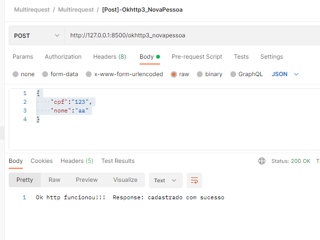
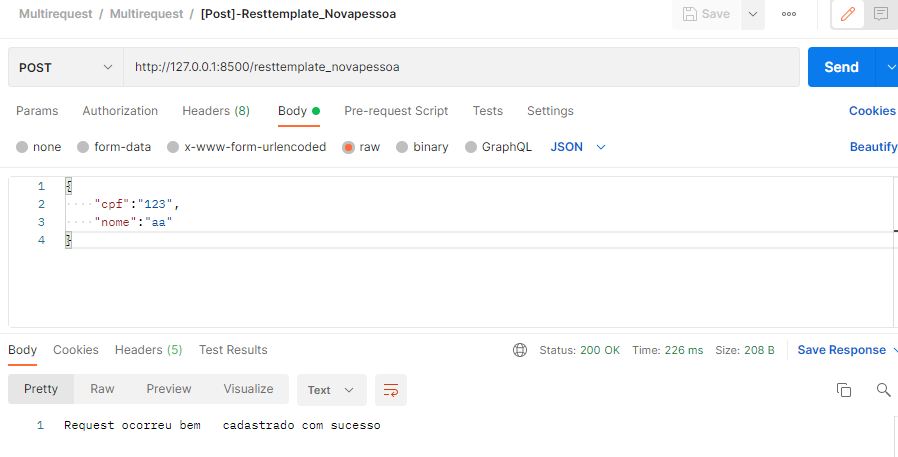

# multirequest 
Projeto criado com finalidade de emular requests rest 
para outros serviços.  
Projeto prativo voltado  a demonstrar um teste pratico das ferramentas:  
*OkHttp3  
*RestRequest  
*Feign Client (Ainda não disponivel.) 
Executa um teste pratico de um post passando body e header.
  
-Requisitos: 
*Java11; 

### Como Rodar?
1) Você abre o projeto app_apifake e o executa.
2) Você abre o multirequest e o executa.
3) Dito isso, você importa a  <a href="Multirequest.postman_collection.json">collection</a> no postman e executa os request conforme preferir.
    

Prints demonstrando abaixo: 
  
  